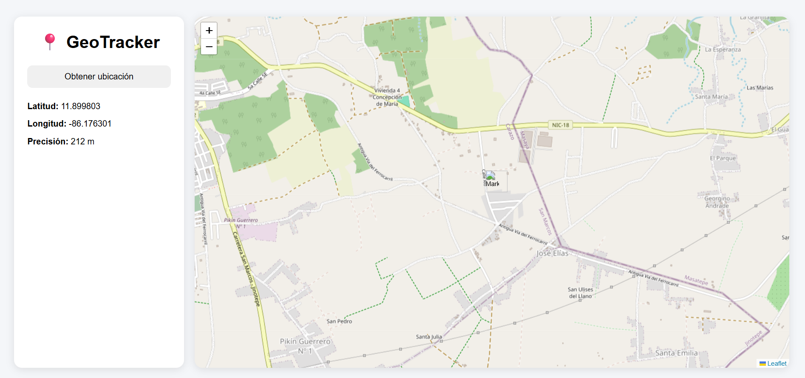

# 📍 GeoTracker

Aplicación web desarrollada en React que permite obtener la ubicación actual del usuario mediante la API de Geolocalización del navegador y visualizarla en un mapa interactivo utilizando OpenStreetMap y React Leaflet.

---

## 🚀 Características

* Obtiene la ubicación actual del usuario.
* Muestra latitud y longitud en tiempo real.
* Visualiza la ubicación en un mapa interactivo.
* Muestra la precisión de la geolocalización.
* Interfaz moderna y responsive.
* Desarrollado completamente en React sin backend.

---

## 🛠️ Tecnologías Utilizadas

* React
* JavaScript
* React Leaflet
* Leaflet
* OpenStreetMap
* CSS3

---

## 📷 Vista Previa



---

## 📂 Estructura del Proyecto

```text
src/
│
├── pages/
│   └── Home.js
│
├── styles/
│   └── app.css
│
├── App.js
├── main.js
│
public/
│
└── image.png
```

---

## ⚙️ Instalación

Clonar el repositorio:

```bash
git clone https://github.com/ErvinCAmpie/GeoTracker.git
```

Ingresar al proyecto:

```bash
cd GeoTracker
```

Instalar dependencias:

```bash
npm install
```

Ejecutar la aplicación:

```bash
npm run dev
```

---

## 🎯 Funcionalidades

* Solicita permisos de ubicación al usuario.
* Obtiene coordenadas geográficas mediante Geolocation API.
* Centra automáticamente el mapa en la ubicación detectada.
* Coloca un marcador indicando la posición actual.

---

## 👨‍💻 Autor

Erving Isaac C.

Proyecto desarrollado como práctica de React y Geolocalización para portafolio profesional.
